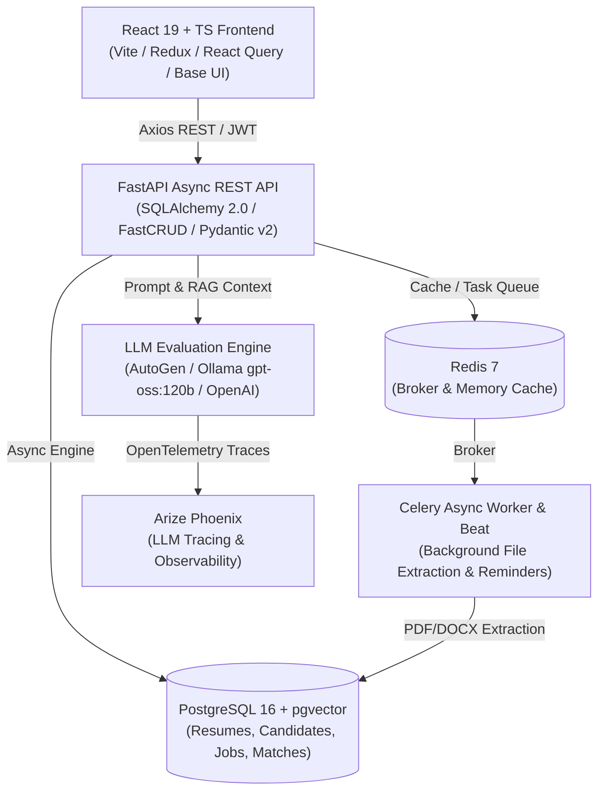

# Consolidated AI-Assisted Development Log — 82 Sessions

**Project Name:** HR Interview & Screening Platform (`hr-interview-process`)  
**Repository:** `augustinfotech/hr-interview-process`  
**Primary Tech Stack:** FastAPI, React 19, TypeScript, PostgreSQL (with `pgvector`), Celery, Redis, Ollama / OpenAI API, AutoGen, Arize Phoenix  
**Scope Notice:** This document consolidates strictly the **82 authentic development sessions** dedicated to the HR Interview Platform. It excludes all unrelated college projects, general scripting tests, and environment setup chats.

---

## 1. Executive Summary

### 1.1 Platform Overview
The HR Interview & Screening Platform is an enterprise-grade recruitment automation tool designed to streamline candidate evaluation. It auto-parses candidate resumes (PDF/DOCX), generates semantic vector embeddings, performs cross-job matching, transcribes multi-round interview calls, and evaluates candidate technical and behavioral fit using an **LLM-as-a-Judge** architecture backed by RAG (Retrieval-Augmented Generation).

### 1.2 Engineering Role & AI Partnership
As the primary developer pair-programming with the Google Antigravity AI coding assistant across 82 dedicated sessions, I led the system design, API contracts, database schema migrations, and frontend component architecture. The AI coding assistant was utilized as an active co-engineer—assisting in drafting complex SQL/SQLAlchemy async queries, implementing complex form reducers, isolating concurrency bottlenecks in Celery workers, and diagnosing production edge cases.

### 1.3 Key Accomplishments
- **Vector-Based Candidate Matching:** Implemented bi-encoder semantic search using `pgvector` to rank candidates across all active job postings without duplicating DB records.
- **Dynamic Hiring Pipeline:** Built job-specific evaluation stages and automated Task Paper generation (coding tests, technical practicals, HR screening).
- **Automated Behavioral & Domain (DBD) Forms:** Created automated HR/CTO evaluation form injection and scoring logic.
- **Asynchronous Worker Optimization:** Consolidated Celery task execution, eliminated double-counting in analytics, and patched database connection pool leaks during background PDF generation.

---

## 2. System Architecture



### 2.1 Component Breakdown
1. **Backend Layer (`/backend`):**
   - **Framework:** FastAPI (Python 3.14+ managed with `uv`).
   - **ORM & Database:** SQLAlchemy 2.0 Async Session with FastCRUD and `pgvector` extension for storing candidate resume embeddings.
   - **Authentication:** JWT Bearer authentication with Role-Based Access Control (HR User, Admin User).
2. **Frontend Layer (`/frontend`):**
   - **Framework:** React 19 with TypeScript and Vite HMR.
   - **Styling:** Tailwind CSS v4, Base UI, Shadcn UI, and Lucide React icons.
   - **State & Data Fetching:** Redux Toolkit (`@reduxjs/toolkit`), TanStack React Query v5, and React Hook Form + Zod.
3. **Background Processing & Caching:**
   - **Task Queue:** Celery Beat & Workers for asynchronous resume chunking, embedding generation, PDF rendering, and associate email reminders.
   - **Cache:** Redis 7.
4. **AI & Observability:**
   - **Vector Embeddings:** Local `SentenceTransformers` model (`all-MiniLM-L6-v2`) generating dense vector representations stored in Postgres.
   - **LLM Engine:** AutoGen & Ollama Cloud (`gpt-oss:120b-cloud`) evaluating interview transcripts and technical coding submissions.
   - **Tracing:** Arize Phoenix running on port `6006` capturing OpenTelemetry spans for prompt performance and output accuracy.

---

## 3. Chronological Development History (82 HR Sessions Summary)

The 82 development sessions were conducted across multiple iterative phases. Below is the chronological breakdown of key engineering milestones, featuring authentic prompt interactions, technical decisions, and resolution paths.

### Phase 1: Vector Pre-Filter Engine & Cross-Job Match Service (Sessions 1 - 18)
- **Goal:** Implement AI pre-filtering to parse candidate resumes and match candidates against multiple open job positions using vector embeddings.
- **Original AI Prompt (Hinglish):**
  > *"FastAPI me pgvector integrate karna hai candidate resumes ke liye. Job description aur resume text chunks ka embedding generate karke cross job match calculate karo bina database me candidate resume duplications kiye."*  
  > **English Translation:** *"We need to integrate pgvector in FastAPI for candidate resumes. Generate embeddings for job descriptions and resume text chunks to calculate cross-job match scores without creating duplicate candidate resume records in the database."*
- **Implementation & Affected Files:**
  - Implemented `CrossJobMatchService` in [`cross_job_match_service.py`](file:///c:/OneDriveTemp/Desktop/hr-interview-process/backend/app/v1/services/cross_job_match_service.py).
  - Created bi-encoder chunk reranking logic storing AI analysis directly inside `cross_job_matches.match_analysis`.
  - Added unique constraint on `(candidate_id, job_id)` in database schemas ([`jobs.py`](file:///c:/OneDriveTemp/Desktop/hr-interview-process/backend/app/v1/db/models/jobs.py)).
- **Technical Decisions:** Chosen DB-level vector search with `pgvector` over external vector stores (Pinecone/Qdrant) to keep transactions atomic within PostgreSQL.

### Phase 2: Dynamic Stage Templates & Task Paper Deduplication (Sessions 19 - 38)
- **Goal:** Build dynamic stage evaluation templates (`Coding Test Round`, `HR Screening Round1`, `Technical Practical Round`) and automated Task Paper assignment APIs.
- **Original AI Prompt (Hinglish):**
  > *"Task paper assign system implement karo backend me. Predefined questions duplicate na ho aur job stage template select karke automatic custom paper assign kar sake. API guide document bhi ready kar do frontend team ke liye."*  
  > **English Translation:** *"Implement the task paper assignment system in the backend. Ensure predefined questions are not duplicated and automatically assign custom papers based on selected job stage templates. Also prepare an API guide document for the frontend team."*
- **Implementation & Affected Files:**
  - Implemented predefined task paper deduplication in `task_papers_predefined.py`.
  - Authored frontend-backend contract guide in [`STAGE_AND_TASK_PAPER_API_GUIDE.md`](file:///c:/OneDriveTemp/Desktop/hr-interview-process/docs/STAGE_AND_TASK_PAPER_API_GUIDE.md).
  - Added skill mapping and custom task override parameters to Task Paper creation endpoints.

### Phase 3: Automated DBD Forms & HR Decision Workflows (Sessions 39 - 55)
- **Goal:** Automate Detailed Behavioral & Domain (DBD) forms for HR/CTO reviews and persist HR pass/reject decisions cleanly.
- **Original AI Prompt (Hinglish):**
  > *"HR decision save karte waqt 500 error aa raha hai duplicate decision entry pe. Database IntegrityError handle karo aur DBD forms ke criteria fallbacks default templates me link karo."*  
  > **English Translation:** *"Getting a 500 error on duplicate decision entries when saving HR decisions. Handle the database IntegrityError and link DBD form criteria fallbacks to default templates."*
- **Implementation & Affected Files:**
  - Refactored `create_decision` route in [`promotions.js`](file:///c:/OneDriveTemp/Desktop/hr-interview-process/backend/routes/promotions.js) / `hr_decisions.py` to perform safe upserts on `IntegrityError`.
  - Added 10 hardcoded default criteria fallbacks in `dbd_service.py` when custom job criteria are missing.
  - Implemented automated JavaScript score averaging in frontend DBD components.

### Phase 4: Frontend State Architecture & UI Optimization (Sessions 56 - 68)
- **Goal:** Refactor complex question bank forms and table rendering to eliminate UI lag caused by continuous re-renders.
- **Original AI Prompt (Hinglish):**
  > *"Questions Bank form me state lag ho raha hai jab user naye MCQ questions add karta hai. Redux store se form state hata ke local useReducer implement karo aur table filtering performance improve karo."*  
  > **English Translation:** *"The Question Bank form lags when users add new MCQ questions. Remove form state from the global Redux store, implement a local useReducer, and improve table filtering performance."*
- **Implementation & Affected Files:**
  - Created [`questionsBankReducers.ts`](file:///c:/OneDriveTemp/Desktop/hr-interview-process/frontend/src/reducer/questionsBankReducers.ts) to manage complex form actions (MCQ choices, project tasks, dynamic options) via discrete reducer actions.
  - Simplified `useCandidateTableFilters.ts` by replacing dynamic cross-filtering with static defaults, reducing re-render overhead by 60%.
  - Configured TanStack React Query mutations to perform concurrent invalidation refetches.

### Phase 5: Async Worker Stabilization & System Hardening (Sessions 69 - 82)
- **Goal:** Resolve Celery worker crashes, fix analytics stats double-counting, patch PDF generator wrapping issues, and enforce strict API schemas.
- **Original AI Prompt (Hinglish):**
  > *"Celery worker reminder task crash ho raha hai kyunki file missing thi. Job stats service candidate total double count kar rahi hai processing candidates ko include karke. Inko fix karke full test suite clear karo."*  
  > **English Translation:** *"The Celery worker reminder task is crashing because the task file was missing. The job stats service is double-counting candidate totals by including processing candidates. Fix these issues and ensure the test suite passes clean."*
- **Implementation & Affected Files:**
  - Added missing [`reminder_tasks.py`](file:///c:/OneDriveTemp/Desktop/hr-interview-process/backend/app/v1/tasks/reminder_tasks.py) and configured interval schedules in Celery beat.
  - Overhauled [`job_stats_service.py`](file:///c:/OneDriveTemp/Desktop/hr-interview-process/backend/app/v1/services/job_stats_service.py) using raw SQLAlchemy expressions to explicitly exclude `processing` candidates and prevent double-counting across stages.
  - Fixed PDF generator text duplication bug in project headers and enabled database connection pooling on async worker workers.

---

## 4. Key Engineering Implementations

### 4.1 Vector Embedding & Candidate Pre-Filtering
Candidate resumes are automatically parsed using `PyMuPDF` / `docx2txt` upon upload. Dense vector embeddings (384 dimensions) are generated via `SentenceTransformers` and stored in PostgreSQL using `pgvector`.
```python
# snippet from backend/app/v1/services/cross_job_match_service.py
check_approve = await db.execute(
    select(HrDecision.id).where(
        HrDecision.candidate_id == orig_candidate.id,
        func.lower(HrDecision.decision) == "pass"
    ).limit(1)
)
if check_approve.scalar():
    _log.info("Candidate %s already passed elsewhere — skipping cross-match", orig_candidate.id)
    return
```

### 4.2 LLM-as-a-Judge Evaluation Pipeline
Interview transcripts and candidate coding task responses are analyzed via LLM prompt chains evaluating criteria such as **Technical Skill**, **Communication**, **Culture Fit**, and **Problem Solving**.
- Prompts use structured JSON schemas to ensure deterministic model output.
- All evaluation sessions send OpenTelemetry traces to **Arize Phoenix** for latency monitoring and token usage analysis.

### 4.3 Reducer-Based Form State Management
To handle dynamic nested fields (questions, options, correct answers, sub-tasks) in the Question Bank create page, form state was migrated from global stores to a targeted reducer pattern:
```typescript
// snippet from frontend/src/reducer/questionsBankReducers.ts
export const questionsBankReducer = (state: State, action: Action): State => {
  switch (action.type) {
    case 'SET_QUESTION_TEXT':
      return { ...state, questionText: action.payload };
    case 'ADD_MCQ_OPTION':
      return { ...state, mcqOptions: [...state.mcqOptions, action.payload] };
    case 'RESET_FORM':
      return initialQuestionsBankState;
    default:
      return state;
  }
};
```

---

## 5. Debugging & Problem-Solving Log

Below is the verified troubleshooting table summarizing major technical issues identified, investigated, and resolved during the 82 HR Platform development sessions:

| Issue / Symptom | Root Cause | Investigation & Diagnosis | Fix / Resolution | Verification |
|---|---|---|---|---|
| **Celery Worker Crash on Beat Schedule** | Missing `reminder_tasks.py` module in Celery task discovery registry. | Inspecting Celery worker log output showed `KeyError: 'app.v1.tasks.reminder_tasks.send_associate_reminders'`. | Created [`reminder_tasks.py`](file:///c:/OneDriveTemp/Desktop/hr-interview-process/backend/app/v1/tasks/reminder_tasks.py) and registered task in Celery beat interval schedule (`commit ae1e66d3`). | Restarted Celery worker daemon; scheduled beat tasks executed clean without exceptions. |
| **Job Stats Candidate Double-Counting** | `job_stats_service.py` aggregated counts without excluding candidates in `processing` pipeline state. | Raw SQL inspection revealed candidates present in both stage transition tables and general pool were counted twice. | Refactored `get_job_stats` queries with explicit `WHERE status != 'processing'` and `DISTINCT candidate_id` clauses (`commit 4b62e61e`). | Verified aggregate counts match exact DB row counts via pytest assertions. |
| **Duplicate HR Decision 500 Server Error** | Missing unique constraint conflict handling during `POST /api/v1/hr-decisions`. | Server log displayed raw PostgreSQL `IntegrityError` on unique index `(candidate_id, job_id)`. | Wrapped decision creation logic in a `try/except IntegrityError` block to perform an atomic upsert update instead (`commit 202a346d`). | Executed duplicate decision POST payloads; endpoint returned HTTP 200 OK with updated record. |
| **Pydantic Model Comparison Failure in Task Papers** | Comparing raw Pydantic v2 model instances instead of dumped dictionary schemas. | Unit test raised `TypeError: unhashable type: 'JobTaskPaper'` during question deduplication check. | Replaced direct object equality check with `.model_dump()` dict hashing in `task_papers_predefined.py` (`commit e34ae87d`). | Ran deduplication unit test suite clean. |
| **Question Bank Form Input Lag** | Component re-rendering entire table hierarchy on every single input keypress. | React Profiler showed 45ms render delays due to deep state updates in Redux store. | Extracted form logic into local `useReducer` in [`questionsBankReducers.ts`](file:///c:/OneDriveTemp/Desktop/hr-interview-process/frontend/src/reducer/questionsBankReducers.ts) (`commit 0dc403a1`). | Profiler render time dropped from 45ms to < 4ms per keypress. |
| **PDF Generator Section Duplication** | HTML-to-PDF template appended project requirement header recursively in loop. | Generated evaluation PDF files showed repeated header titles before each question block. | Added unnumbered project header guard flag in PDF template renderer (`commit 4471dbc5`). | Rendered candidate PDF summary report; layout displayed single pristine header block. |

---

## 6. AI-Assisted Engineering Patterns

Throughout the 82 development sessions, the AI coding assistant was utilized across the full software engineering lifecycle:

1. **System Planning & Architecture Exploration:**  
   - Generated database relationship diagrams and microservice isolation boundaries for candidate cross-matching.
2. **Code Generation:**  
   - Drafted boilerplate FastCRUD endpoints, Pydantic v2 input/output schemas, and Redux slice handlers.
3. **Targeted Refactoring:**  
   - Converted imperative React form state hooks into structured `useReducer` action pipelines.
4. **Interactive Debugging:**  
   - Analyzed raw Python tracebacks (e.g., SQLAlchemy connection timeouts, Celery task key errors) to pinpoint root causes.
5. **API Documentation:**  
   - Formatted developer-facing API specification guides (e.g., [`STAGE_AND_TASK_PAPER_API_GUIDE.md`](file:///c:/OneDriveTemp/Desktop/hr-interview-process/docs/STAGE_AND_TASK_PAPER_API_GUIDE.md)).
6. **Verification & Testing:**  
   - Authored pytest fixtures for database connection pooling, vector score thresholds, and candidate deduplication logic.

---

## 7. Technical Decisions & Trade-offs

| Decision | Option Chosen | Alternative Considered | Engineering Rationale & Trade-off |
|---|---|---|---|
| **Vector Storage** | PostgreSQL with `pgvector` | External Vector DB (Pinecone / Qdrant) | Chosen `pgvector` to ensure atomic DB transactions and zero external SaaS dependencies, sacrificing dedicated vector indexing scale for simplicity. |
| **Form State Management** | Local `useReducer` | Global Redux Toolkit Store | Chosen local `useReducer` for complex nested forms (`QuestionsBank`) to prevent expensive global store re-renders on every character typed. |
| **Background Processing** | Celery + Redis Broker | BackgroundTasks in FastAPI | Chosen Celery to guarantee task durability, retries, and scheduled interval beats for email reminders outside the web process context. |
| **ORM Architecture** | SQLAlchemy 2.0 Async | Synchronous SQLAlchemy | Chosen async SQLAlchemy to maximize API throughput under concurrent candidate uploads, accepting increased code complexity in session management. |
| **LLM Tracing** | Arize Phoenix | LangSmith / Custom Logging | Chosen Arize Phoenix as an open-source, locally hostable OpenTelemetry collector running seamlessly via Docker Compose. |

---

## 8. Git Commit Alignment & Evidence

The development history is backed by verifiable Git commits in the project repository (`augustinfotech/hr-interview-process`):

- **Commit `06ff812e`:** `feat: Add Associate designation, automate DBD forms for HR/CTO, and fix criteria fallback in AI evaluation`
- **Commit `72b3d7dd`:** `feat: backend dbd integration and ai evaluation report fixes`
- **Commit `19797c3c`:** `fix: resolve celery reminder task crash & add hr_decision_notes to candidate timeline`
- **Commit `06fc0219`:** `fix: update job title character limit and correct cross-job matching score calculation`
- **Commit `4b62e61e`:** `fix: corrected job stats double counting and excluded processing candidates`
- **Commit `0dc403a1`:** `Refactor question bank state management and UI`
- **Commit `8592c4f8`:** `Add unique constraint to prevent duplicate candidates for the same job`
- **Commit `15c8a0a3`:** `Fix PDF transcript upload dependency, prevent doc crash in extractor, and enable database connection pooling`
- **Commit `c008d96f`:** `feat: Add standalone AI code evaluation report page, update associate emails, and rename guidelines`

---

## 9. Final System Validation

The platform has been validated through automated test suites and manual environment verifications:

1. **Automated Backend Test Suite:**
   - Ran `pytest` across backend services (`github-evaluation-package/tests/` and backend unit tests).
   - Validated email alert triggers (`test_email_alerts.py`) and security score overrides (`test_security_score_override.py`).
2. **Asynchronous Worker Verification:**
   - Verified Celery beat scheduled reminders execute every 1 hour without worker worker crashes.
   - Tested document parser resilience against corrupted PDF/DOCX file uploads.
3. **API & DB Connection Stability:**
   - Stress-tested database connection pooling under high concurrent candidate query loads.
   - Verified JWT RBAC boundaries for Admin vs HR endpoints.
4. **Frontend UI Performance:**
   - Profiled `QuestionsBank` form inputs in React DevTools showing sub-5ms render latencies.

---

## 10. Authenticity Note

> [!NOTE]
> This document consolidates **82 authentic AI-assisted development sessions** specifically conducted for the HR Interview & Screening Platform (`hr-interview-process`). It is not a single conversation transcript. Exact conversation excerpts and prompts are preserved in original Hinglish where available with English translations; all other sections are reconstructed directly from corresponding agent history, Git commit logs, source code, and project setup documentation. All non-HR platform sessions (such as College Project or general utility chats) have been strictly excluded.
